# Explainability-Guided Mileage-Proxy Recognition, Tyre Localisation and Learned Image-Space Geometry

## A reproducible pilot study under small-sample and split-dependence constraints

**Full project report · Updated author-review edition · 15 September 2026**

Bonala Shanmukesh · Gunnamneni Nehru · GV Manu Rohith · Nettem Harish Kumar  
Department of AI & ML, SCOPE, VIT-AP University  
Guide: Dr. E. Sreenivasa Reddy, Professor-HAG

Original capstone title: *Vision-Based Detailed Tyre-Wear Recognition and Single-Wheel Alignment Screening*. The narrower report title describes the evidence actually available; it does not permanently remove the deferred components of the original proposal.

> **Reading this report:** Results concern three mileage-proxy classes in a small image collection. They do not establish measured tread depth, roadworthiness, alignment, or independent new-tyre generalisation. Training and reporting execution are complete for the implemented tracks; original-plan extensions and final institutional approval are not.

## Abstract

Visual tyre analysis is attractive because cameras can provide non-contact observations of the tyre surface. However, classifiers can exploit background or capture identity instead of wear-related appearance. The prepared dataset contains 418 unique photographs and 4,180 synthetic derivatives in 12 timestamp-derived sessions and three mileage-proxy classes. On 15 September the operator confirmed that the sessions represent 12 different physical tyres, without an independent identity audit. Original classification folds retain their historical overlap flags; the later geometry comparison uses a separately frozen tyre-group allocation.

The retained architecture sweep comprises 153 valid runs across 17 architectures; nine mislabeled substitutions are excluded. An explanation-gated shortlist supports 108 one-factor-at-a-time runs, followed by 18 same-fold confirmation runs. The dense-task extension completes 81 runs across semantic segmentation, YOLO detection/instance segmentation, and RT-DETRv2 detection, each evaluated at the final epoch of a 60-epoch budget. Saved predictions support five fixed fusion arms without additional fitting. Across 81 equally weighted source runs, predicted-tyre and predicted-tread crops change macro-F1 by −0.01257 and −0.01467 relative to full-frame classification; equal full-frame/tyre/tread probability fusion changes it by −0.01324. These are descriptive paired results, not independent-sample significance estimates. Selected-epoch classification scores can substantially exceed fixed-final scores, and calibration behaviour differs by fold.

A later 120-image, six-point annotation study compares HRNet-W18 with freshly trained SegFormer-B0 on the same 72/24/24 training/validation/test images, representing 8/2/2 user-confirmed distinct tyres. Both complete three seeds and 60 epochs. Mean horizontal point error is 1.312% of image width for HRNet and 1.721% for SegFormer, a 23.75% relative reduction, with complete SegFormer boundary coverage. Supervision differs—point targets versus dense masks—so this is not an architecture-only comparison. The native Tread Station app now integrates both models and a target-assisted alignment workflow. Saved software tests pass, but real-video examples expose crossed boundaries and model disagreement; physical alignment accuracy remains unvalidated. The contribution is an auditable pilot workflow that distinguishes completed software from established physical or deployment validity.

**Keywords:** tyre imagery; mileage proxy; shortcut learning; explainability; semantic segmentation; detection; reproducibility; small datasets.

## Executive summary

The project has produced a substantial implemented study and a functioning native inspection prototype, not a certified tyre-inspection system. Classification, explanation screening, controlled interventions, manual-supervised dense tasks, exploratory fusion and the matched HRNet–SegFormer experiment have public execution records. The desktop app, learned-geometry integration and target-assisted alignment interface have saved local software-test evidence. Their implementation is complete; independent field accuracy and the original full PatchCore/Tier8 experiment are not.

Three practical findings organise the report. First, a selected validation checkpoint and the final checkpoint answer different questions; their results must remain separate. Second, recovering tyre or tread regions does not automatically help an existing full-frame classifier. Third, the current data cannot settle the original physical claims: images labeled by mileage are not calibrated wear measurements, and many photographs of a few capture sessions do not constitute many independent tyres.

No new GPU execution or download was required for this document refresh. The earlier evidence cache contains approximately 3.02 MiB of downloaded content; the subsequent geometry audit added about 1.01 MB of metadata. Existing local prototype screenshots and test records are reused. This updated report contains 22 visuals and incorporates the new results directly into its methods, results, discussion and conclusions. A venue-specific template, author declarations and approval remain human submission tasks.

## 1. Introduction and motivation

### 1.1 Problem setting

The original project proposed a multi-component vision system for detailed tyre-wear recognition and single-wheel alignment screening. During development, the available labels and collection conditions required a more careful experimental interpretation. The executed classification target is an ordered, three-level mileage proxy. Although mileage and wear may be related in a particular collection, that relationship is not a measured physical calibration: road surface, loading, tyre construction, inflation and driving conditions can change it. Consequently, a correct proxy label cannot be translated into a millimetre tread-depth estimate or a safety decision.

The study asks how classifiers behave on this collection, where attribution falls, whether localisation changes classification and whether dedicated point learning improves boundary localisation. A native inspection app and target-assisted alignment software are now implemented. No physical rig performance, real alignment accuracy or roadworthiness decision system is validated here.

### 1.2 Why accuracy alone is insufficient

A background cue or capture-session signature can predict a dataset label without representing the intended tyre property. A model with high validation accuracy may therefore be useful only within the collection. The problem is particularly acute when the effective sampling unit is a tyre or session but the reported sample count is the number of photographs. Synthetic derivatives provide optimisation variation; they do not create independent evidence.

The project responds with simple baselines, model-identity checks, explanation-method gates, controlled image interventions, and paired downstream evaluations. These diagnostics can expose weaknesses, but none converts a dependent internal split into an independent test. Attribution on the tread is a spatial association, not proof that a model reasons causally about wear.

### 1.3 Contributions and boundaries

Implemented contributions include a prepared-data audit, architecture comparison with quarantines, explanation-informed follow-ups, manual-supervised dense tasks, paired ROI/fusion analysis, matched boundary learning, a native evidence-preserving prototype and a versioned reporting workflow. These are pilot engineering and empirical contributions, not a validated physical wear metric or universal architecture ranking.

## 2. Related work and conceptual foundations

### 2.1 Physical measurement versus image-label recognition

TireEye describes an optical on-board approach that analyses groove geometry and uses a physical scale reference [1]. It is relevant because it illustrates a different target: measuring a physical property rather than recognising a proxy class. Its numerical results are not directly comparable with this project's macro-F1. A fair comparison would require compatible targets, physical reference measurements and independent test conditions, none of which can be reconstructed from the current labels.

### 2.2 Recognition and ordinal targets

Residual learning provides a widely used image-recognition backbone family [2]. This study compares convolutional and transformer-based implementations rather than treating one family as a presumed winner. The three class labels have an order, which motivates retaining ordinal decision semantics where CORAL heads are used [3]. A CORAL output is not interpreted by applying a softmax-style argmax to its thresholds. Implementation identity and decision rule are part of the experiment, not interchangeable reporting details.

### 2.3 Explanation is a diagnostic, not a certificate

Grad-CAM produces class-related localisation using gradients and feature activations [4]. The sanity-check literature shows why attractive saliency maps need tests of dependence on learned parameters [5]. Accordingly, NB07 evaluates method faithfulness and randomisation sensitivity before using spatial attribution summaries. This project-specific gate is useful for rejecting unsuitable methods, but passing it does not establish all possible notions of explanation validity or physical causality.

### 2.4 Dense prediction and uncertainty

HRNet's high-resolution representation design [13] motivates the later point-learning adapter; the tyre targets and evaluation are project-specific. The target-assisted alignment interface uses ChArUco board detection/pose concepts documented by OpenCV [14]. Neither reference establishes this project's field or physical accuracy.

U-Net, DeepLabV3+ and SegFormer supply distinct encoder/decoder approaches to dense prediction [6–8]. The detection branch additionally uses YOLO26 software and a genuine RT-DETRv2-R18 checkpoint [9–10]. Their native objectives and pretraining differ, so the comparison is not an equal-pretraining architecture-only ablation. Temperature scaling and conformal prediction motivate the uncertainty analyses [11–12], while their interpretation remains constrained by finite samples and dependence in the available splits. References distinguish primary papers from software documentation; unverified claims from earlier planning notes are not imported as established related work.

## 3. Research questions and experimental scope

| Question | Implemented evidence | What it can answer |
|---|---|---|
| RQ1: How sensitive are classification results to architecture, fold and endpoint? | Baselines, retained Stage A, final/selected metrics | Internal comparative behaviour; not an external leaderboard |
| RQ2: Can spatial explanation diagnostics inform follow-up selection? | NB07 gates, seed confirmation, Stage B | Which candidates satisfy the implemented selection rule |
| RQ3: Do selected training interventions repeat on other architectures? | 18 S4b runs | Same-fold directional confirmation, not independent replication |
| RQ4: Can existing masks supervise tyre/tread localisation? | 81 S5 runs and native-coordinate evaluation | Agreement against the existing manual reference |
| RQ5: Do predicted crops or fixed fusion improve a frozen classifier? | Paired ROI and NB18 fusion tables | Fixed intervention effects in the existing folds |
| RQ6: Does a dedicated point model improve boundary localisation? | Matched HRNet/SegFormer, three seeds, two test tyres | Point-error difference under matched split/budget, not equal supervision |
| RQ7: Can the components support an auditable inspection interface? | Tread Station and saved local software checks | Operational integration and failure display, not field accuracy certification |

Historical H1 asks whether normalised tread evidence predicts cross-fold stability better than accuracy. Its inherited analysis uses selected-epoch statistics and is not supported by the recorded result. H2 is inconclusive/undefined in the implemented evidence. H3 lacks the planned fine-grained model arms and remains untested. These outcomes are retained rather than replaced with post-hoc favourable hypotheses.

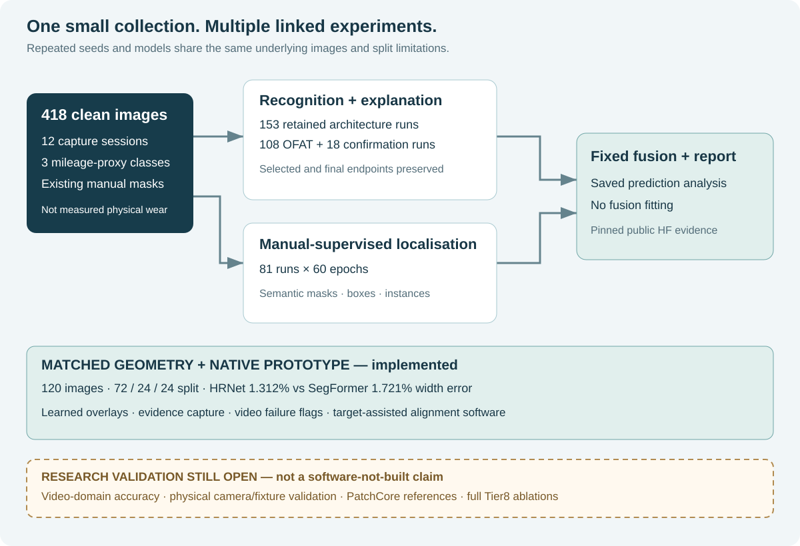

*Figure 1. Implemented evidence flow, including learned geometry and the desktop prototype. Shared source images do not create independent replications. The dashed strip separates remaining research validation from software already built.*

| Stage | Verified implementation | Completion boundary |
|---|---|---|
| S1 | Legacy baselines and matched random-init recovery | Legacy 15-epoch baseline remains distinct from matched 60-epoch control |
| S2 | 17 architectures, 153 valid runs | Nine mislabeled Small runs excluded, not repaired by relabeling |
| S3 | Manual/replay checks | Blind repeat annotation and SAM2 comparison deferred |
| S4 / S4b | 108 OFAT + 18 confirmation runs | Wider original technique tiers not all executed |
| S5 | 81 dense-task runs, all 60 epochs, NB17 report | Manual-supervised scope only |
| Explanation/stress/uncertainty tracks | NB07–NB10 and recovery reporting | Original video/factorial/FGVC extensions remain missing |
| S9 | Fixed fusion, matched geometry study and optional learned-geometry prototype integration complete | PatchCore, original Tier8 ablations and independent end-to-end/video accuracy remain open |
| S10 | Reporting execution and refreshed 22-visual manuscript complete | Author review and venue-specific submission outstanding |
| Alignment | Target-assisted calibration/measurement software and synthetic checks implemented | Physical calibration, fixture/rack comparisons and real error validation remain open |
| App | Native Tread Station implemented and locally tested | Physical webcam and wider deployment validation remain open |

## 4. Dataset, labels and sampling limitations

### 4.1 Preparation and class composition

The frozen preparation record describes 888 raw files, of which 470 byte-identical duplicates were removed, leaving 418 clean photographs. Ten pre-generated derivatives per clean image produce 4,180 derivative files, or 4,598 files when clean originals are included. The clean images are 1152 × 1536 RGB; derivatives are 768 × 768. The collection was captured within approximately 22 minutes on 25 August 2026. That narrow acquisition window limits evidence about changes in weather, illumination, cameras and operating conditions.

| Proxy class | Clean images | Timestamp-derived sessions |
|---|---:|---:|
| Low | 169 | 3 |
| Mid | 97 | 3 |
| High | 152 | 6 |
| Total | 418 | 12 |

The groups were originally defined by a timestamp-gap rule. On 15 September the operator explicitly confirmed that the 12 sessions represent 12 different physical tyres. This report says **user-confirmed distinct tyres**, not independently audited identities. That clarification does not retroactively rerun the old fold audit or make the collection external data. The full preparation record and historical split caveats remain in [the dataset specification](../12_DATASET_FINAL_V1.md).

### 4.2 Folds and leakage flags

| Fold | Clean training originals | Clean validation originals | Interpretation |
|---|---:|---:|---|
| 0 | 232 | 186 | Suspected same-tyre cross-fold overlap flagged |
| 1 | 290 | 128 | No listed overlap flag; still a small internal split |
| 2 | 314 | 104 | Suspected same-tyre cross-fold overlap flagged |

Classification training can include derivatives linked to training originals; S5 uses clean originals only. Validation uses clean held-out photographs. Group-aware construction prevents some obvious derivative leakage, but does not prove independent tyre identity when session boundaries are imperfect proxies. Folds 0 and 2 are descriptive diagnostics, not credible independent-generalisation estimates. Fold 1 has only a few sessions and cannot alone resolve the problem.

The large number of optimisation runs must not obscure this small underlying evidence base. Three random seeds characterise training variation conditional on the data; they do not triple the tyre sample size. Standard deviations over seeds are therefore not tyre-population confidence intervals. A future external evaluation requires tyres collected independently, recorded identities, and labels that match the intended physical claim.

### 4.3 Manual mask reference and annotation limits

Existing manual masks supply the S5 supervision. The canonical tyre region is `mask > 0`; the tread region is `(mask == 2) OR (mask == 3)`. These are overlapping regions: tread belongs within tyre. A mutually exclusive tyre/tread softmax would misrepresent this label geometry. Boxes are derived from these regions, so hundreds of new box annotations are not required for the implemented route.

NBT1 tests annotation propagation/replay. It is not an independent second annotation of the images. Consequently, model-versus-manual IoU cannot be described as annotator self-consistency, inter-annotator agreement or unedited-SAM2 agreement. Those studies remain deferred. Mask quality affects both training and evaluation, so systematic annotation conventions may be learned and reproduced without proving that every boundary is physically exact.

## 5. Methods and execution protocol

### Geometry annotation extension

The later annotation package contains 120 images and 720 visible targets: left/right tread boundaries on three fixed horizontal guide rows. These are six horizontal coordinates, not arbitrary anatomical landmarks or physical wheel angles. The original 12 pilot photographs are excluded from the 120-image set, but some tyre identities informed pilot development; the cohort is not untouched external validation. A frozen allocation uses 72 training images from eight tyres, 24 validation images from two tyres and 24 test images from two tyres. Image hashes, guide rows, point order and role assignments are identical in the matched comparison. The test tyres are `mileage_100000_plus__session_006` and `new_tire__session_001`.

### 5.1 Classification sweep and endpoints

The retained sweep covers 17 configurations across three folds and three seeds. It includes residual/dense/VGG-style networks, modern convolutional models, transformer and hybrid architectures, and foundation-pretrained representations. The recorded architecture identifiers in Table 2 below are the reproducible names. The excluded `convnextv2_s` statuses reported 11,177,538 parameters and a sampled checkpoint exhibited a ResNet-18 tensor signature. Those nine executions cannot support a ConvNeXtV2-Small claim, regardless of their score. Their public records remain preserved in the quarantine table.

Two endpoints must be distinguished throughout: validation-selected checkpoint performance and fixed-final performance. Selection can reward an early transient peak; a final-epoch score reflects the declared training budget. This report preserves both instead of silently treating the larger value as the experiment's endpoint. Exact per-run configuration and runtime records, not a generic environment file alone, define a reproducible training run.

### 5.2 Explanation screening and follow-up selection

The NB07 implementation screens 18 initial candidates and adds ten confirmation runs for shortlisted screens. Recorded evidence includes 1,208 explanation rows and 35 method-faithfulness rows. Candidate CAM methods undergo the locked randomisation and faithfulness gate. Randomisation sensitivity must exceed 0.05; faithfulness is based on insertion/deletion behaviour. An architecture with no surviving method is excluded from this explanation-based selection, rather than being assigned an invented valid explanation or stopping all remaining architectures.

Normalised tread evidence compares the fraction of nonnegative saliency inside the tread with the tread's image-area fraction: `TER_norm = (saliency mass in tread / total saliency mass) / (tread area / image area)`, where defined. A value above one indicates concentration beyond area share, not causality. On this dataset tread and tyre nearly coincide: the implementation documents a median area ratio of 0.990 and 114 images without visible shoulder. TER therefore primarily distinguishes tyre from background here, not tread from shoulder or groove-level wear evidence. Zero or invalid maps must remain invalid evidence rather than being interpreted as successful localisation. The gate and spatial ranking selected RegNetY-016, DenseNet-121 and ResNet-50 for Stage B; this was not an accuracy-only shortlist.

Precisely, the implemented gate requires `sanity_delta > 0.05` and a non-missing insertion-minus-deletion AUC value, then ranks survivors by that difference. It does not enforce a separate positive faithfulness threshold. The name “faithfulness gate” must not be interpreted as a stronger mathematical guarantee than this actual rule.

### 5.3 OFAT and S4b confirmation

Stage B contains 108 runs: three selected architectures, 12 one-factor changes and three seeds on fold 1. Holding other recipe fields fixed supports a local intervention comparison, but does not identify interactions between factors. A resolution arm and a crop arm run separately do not establish a crossed resolution × ROI effect.

S4b evaluates three selected factors on ConvNeXtV2-Tiny and MobileNetV4, with three seeds each: 18 runs at 60 epochs. The factors are class-weighted sampling, uniform sampling and random initialisation. Their discovery effects are signed; selection did not mean all three were beneficial. Confirmation uses the same fold, so it tests transfer of an intervention across these architectures, not replication on new tyres. Selected and final deltas are both reported because conclusions about sampling depend on the endpoint.

### 5.4 Manual-supervised dense tasks

S5 comprises nine model/task configurations × three folds × three seeds = 81 runs. The semantic group contains U-Net/ResNet-34, DeepLabV3+/ResNet-34, SegFormer-B0 and SegFormer-B2. YOLO26-n and YOLO26-s each supply detection and instance-segmentation configurations. Genuine RT-DETRv2-R18 supplies the final detector; it is not an Ultralytics RT-DETR-L checkpoint renamed as v2.

All runs use 512-pixel inputs and 60 epochs. The declared optimiser is AdamW with learning rate 0.0001 and weight decay 0.01, with cosine scheduling. Batch sizes are four for semantic and YOLO models and two for RT-DETR. Semantic training uses binary cross-entropy plus soft Dice on two sigmoid channels. YOLO and RT-DETR retain native task losses. Horizontal flipping has probability 0.5 for semantic and YOLO training; RT-DETR has no online augmentation. The repaired YOLO policy explicitly disables hidden additional augmentations. Backend-native EMA, pretraining and objective details differ and remain part of the comparison.

YOLO polygon export is checked against each native manual region: rasterised polygons must retain at least 0.98 IoU. All 836 region exports passed, with minimum approximately 0.980092. This validates the representation conversion to the stated tolerance; it does not independently validate the original human mask. Native masks, rather than the approximated polygons, remain the evaluation reference.

### 5.5 Localisation and downstream evaluation

S5 evaluates epoch 60, using native final-epoch EMA for YOLO and final raw weights for the other backends. Box AP and mask AP use COCO-style IoU thresholds from 0.50 to 0.95. Region metrics include IoU, Dice, and boundary F1 at a two-native-pixel tolerance. A high overlap score with a modest boundary score means that area agreement and fine boundary accuracy should not be conflated. Missing quantities for detector-only models are undefined, not zero performance.

For downstream evaluation, the same frozen Stage-A ResNet-50 final checkpoint is matched by fold and seed. Five modes are compared: full frame, predicted tyre crop, predicted tread crop, oracle tyre crop and oracle tread crop. Crops have 5% padding; a missing predicted region falls back to the full image and is recorded. Classification is not retrained on crops. This means a degraded crop result can reflect a distribution shift for the classifier as well as localisation error. Oracle crops are diagnostic upper-information interventions, not deployable learned predictions.

The CORAL class decision is obtained by counting thresholds greater than 0.5; softmax models retain argmax. Preserving that distinction is essential when recomputing F1 from saved predictions. Native coordinates, image identities and per-image probabilities allow the paired comparisons to be checked rather than inferred from summary scores.

### 5.6 Exploratory fusion

NB18 uses saved prediction sets; it does not train another network. Its five fixed arms are full frame, tyre only, tread only, equal tyre/tread probabilities, and equal full-frame/tyre/tread probabilities. There are 405 run/arm metric rows and 56,430 per-image/arm prediction rows. The analysis deliberately does not search for an optimal test-set weight or choose a favourable arm after observing the result. Equally weighting the 81 source runs gives a descriptive summary, not 81 independent samples from a tyre population.

### 5.7 Resource-aware execution and resumability

Training runs in Kaggle sessions with Hugging Face as the persistent record. The later dense-task workflow isolates jobs in child processes, checks working RAM and free space, and uses GPU 0 intentionally rather than claiming unmeasured two-GPU acceleration. The parent owns publication. Normal snapshots are batched at approximately 30-minute intervals; major action completion and catchable interruption request a flush. Rate limits can still delay a request.

Checkpoint granularity depends on the backend: the earlier dense-task engine restores completed epochs; the later geometry engine checkpoints completed optimiser steps and the next-batch cursor. Both retain compatible optimisation/RNG state and depend on the last successful HF publication for cross-session recovery. A forced OS kill or lost unpublished state cannot be guaranteed recoverable. Immutable staging and hash checks protect consistency, not remote-service availability.

### 5.8 Matched geometry method and operational integration

HRNet-W18 is trained on Gaussian horizontal coordinate targets for six boundary points. SegFormer-B0 learns two overlapping dense-mask channels using the existing manual masks of the same 72 training images; no validation/test dense mask enters its training loader. The matched settings are input height/width 512/384, batch size two, AdamW learning rate 0.0001, weight decay 0.01, cosine epoch scheduling, no augmentation, frozen batch-normalisation running statistics, three seeds and a fixed epoch-60 endpoint. The two models have different pretrained backbones and supervision. Their parameter counts are 9,603,962 for the HRNet adapter and 3,714,658 for the matched SegFormer decoder. The previously trained S5 SegFormer checkpoint is not the matched comparator.

SegFormer logits are interpolated to native resolution and thresholded at sigmoid 0.5. Left/right extrema at the fixed guide rows produce points. Empty or frame-clipped boundaries are rejected. The predeclared full-set metric substitutes a training-only mean coordinate for a missing point and also reports raw coverage and conditional error; no substitution was required on the final test set. Horizontal error is `abs(predicted_x − reference_x) / (native_width − 1)`. There are 144 target points per seed and 432 paired records in the three-seed comparison, not 432 independent test subjects.

The geometry engine saves each completed optimiser step with weights, optimiser, scheduler, scaler, RNG state and next-batch cursor. It publishes consistent snapshots at roughly 30-minute intervals and on major completion/catchable Stop. Its deterministic resizing repair retains the strict resume check; the T4 test subsequently passed with zero parameter difference. This is distinct from the older epoch-granularity dense-task engine. A forced kill or failed upload can still lose unpublished work.

Tread Station uses seed 1 / final epoch 60 for both optional geometry models, fixed for local integration without selecting the lowest published test error. Full RGB images are resized to 384×512 with ImageNet normalisation and no crop, rotation search or test-driven augmentation. Native coordinates use width minus one and the frozen guide-row fractions. The operational adapter runs in FP32, whereas training evaluation used AMP; the integration check is not presented as a fresh reproduction of the aggregate benchmark. HRNet coordinates are unconditional proposals, not calibrated confidence or invisible-boundary detection. Display smoothing preserves raw coordinates and resets after seeks, source/mode changes, gaps or flags.

## 6. Results

### 6.1 Baselines expose split sensitivity

**Table 1. Legacy baseline macro-F1 on the three existing folds.** The random-init ResNet-18 row is a historical 15-epoch experiment and is not the matched 60-epoch ResNet-50 control. Means are descriptive fold means. [Source table](evidence/tables/classification_baselines_by_fold.csv).

| Baseline | Fold 0 | Fold 1 | Fold 2 | Mean |
| --- | --- | --- | --- | --- |
| colour_probe | 0.88696 | 0.46405 | 0.12322 | 0.49141 |
| hog_svm | 0.79602 | 0.18182 | 0.98412 | 0.65399 |
| legacy_resnet18_random_15ep_seed1 | 1.00000 | 0.46405 | 1.00000 | 0.82135 |
| majority_train_selected | 0.17655 | 0.21754 | 0.18519 | 0.19309 |
| structure_probe | 0.35445 | 0.11910 | 0.97638 | 0.48331 |

The simple baselines vary markedly across folds. This supports investigating capture-specific cues, but does not identify a unique shortcut mechanism. The later matched ResNet-50 random-init recovery completed nine 60-epoch runs; its audited mean final-epoch macro-F1 is approximately 0.82332, documented separately in [the recovery audit](../21_RECOVERY_COMPLETION_AUDIT.md). It must not be substituted for the legacy ResNet-18 row because backbone, budget and provenance differ.

### 6.2 Architecture results depend on the checkpoint endpoint

**Table 2. Retained architecture results, nine runs each.** “Selected” is the preserved mean selected-checkpoint macro-F1; “final” is the preserved mean fixed-final macro-F1. This table retains the source ordering and is not an independent-test ranking. [Source table](evidence/tables/classification_master_architectures.csv).

| Architecture ID | Runs | Selected macro-F1 | Final macro-F1 |
| --- | --- | --- | --- |
| mobilenetv4 | 9 | 0.99746 | 0.91310 |
| swin_t | 9 | 0.97673 | 0.83478 |
| effnetv2s | 9 | 0.97615 | 0.70874 |
| swin_s | 9 | 0.95259 | 0.85744 |
| clip_b16 | 9 | 0.95076 | 0.78897 |
| resnet50 | 9 | 0.93651 | 0.82922 |
| regnety016 | 9 | 0.93495 | 0.74087 |
| vit_s | 9 | 0.93235 | 0.75858 |
| resnext50 | 9 | 0.92260 | 0.76566 |
| maxvit_t | 9 | 0.92189 | 0.85982 |
| dinov2_b | 9 | 0.91277 | 0.88380 |
| convnextv2_t | 9 | 0.90891 | 0.90238 |
| densenet121 | 9 | 0.89660 | 0.83852 |
| vgg16bn | 9 | 0.89194 | 0.45870 |
| dinov2_s | 9 | 0.87346 | 0.78842 |
| coatnet0 | 9 | 0.80537 | 0.72041 |
| deit3_s | 9 | 0.74726 | 0.72855 |

MobileNetV4 has a selected mean of 0.99746 and a final mean of 0.91310. EfficientNetV2-S changes from 0.97615 to 0.70874, and VGG16-BN from 0.89194 to 0.45870. These differences are too large to hide behind a generic “accuracy” label. They motivate reporting checkpoint policy alongside every main comparison. They do not establish that early stopping would generalise externally, because the selection itself uses the existing validation evidence.

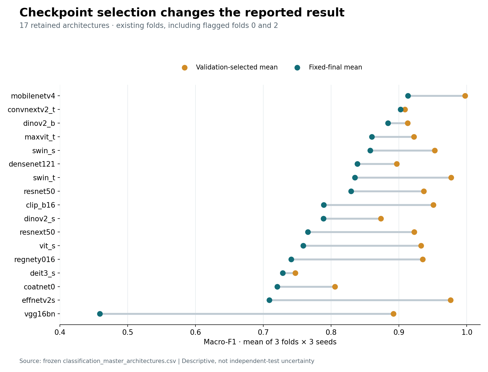

*Figure 2. Report-derived endpoint comparison from the frozen master table. Each connected pair is a mean over nine runs, not an independent-test confidence interval. Both endpoints include the known problematic folds.*

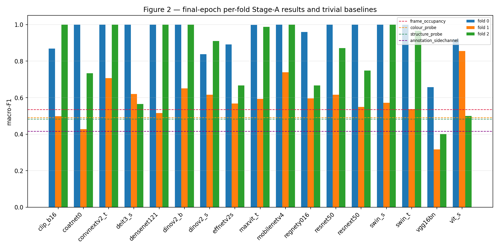

*Figure 3. Preserved NB10R final-epoch per-fold classification panel, as labeled in the source image. It is not a selected-checkpoint plot. Fold differences are substantive and folds 0/2 remain leak-flagged. Dashed reference lines are inherited diagnostic baselines, not certified physical-wear thresholds.*

### 6.3 Explanations and hypotheses

The gate-based shortlist differs from a pure selected-F1 ranking. This is a procedural outcome: it shows that the rule prioritises a different property, not that it has already solved generalisation. The inherited H1 result does not support its proposed advantage; the evidence ledger retains H2 as undefined/inconclusive and H3 as untested.

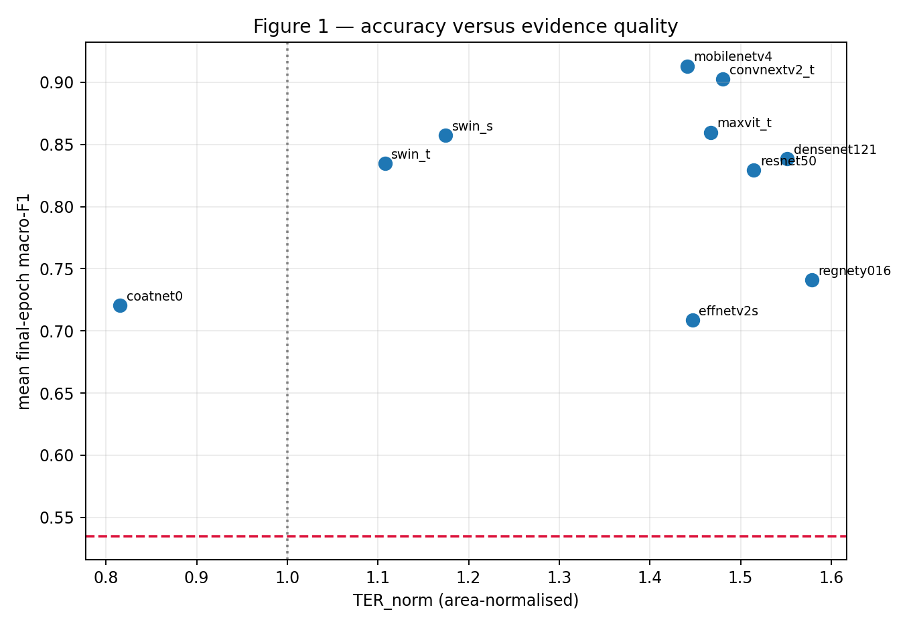

*Figure 4. Preserved accuracy–tread-evidence diagnostic. Despite the generic “accuracy” title, the vertical axis is mean final-epoch macro-F1, consistent with the source's plotted values; H1 in Appendix A separately retains its legacy selected endpoint. Spatial concentration is not proof of reliance on physically meaningful wear features.*

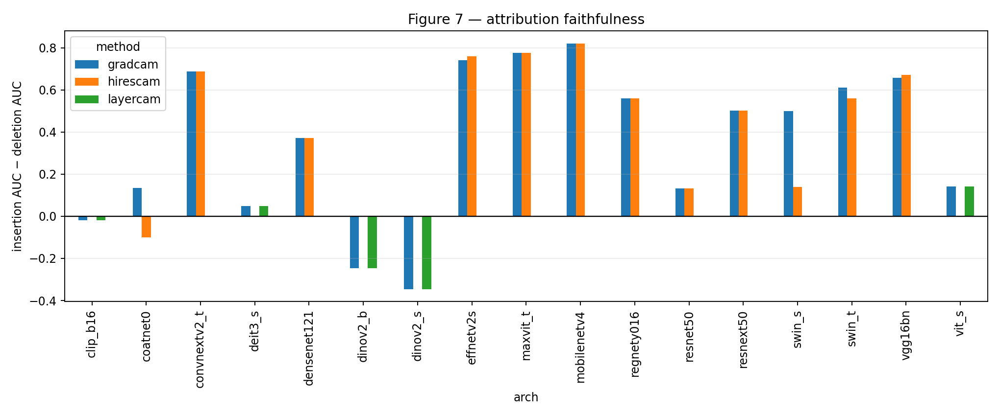

*Figure 5. Preserved insertion-AUC minus deletion-AUC panel. Displayed bars include methods/architectures that do not survive the separate randomisation gate; a positive bar alone does not establish selection eligibility. Gate failures remain exclusions. The complete 30-panel saliency visual is retained in Appendix A.*

### 6.4 S4b confirms some directions, not a universal sampling gain

**Table 3. Same-fold confirmation effects relative to matched baselines.** Deltas are macro-F1; each row summarises three seeds. Direction refers to the source selected-endpoint comparison. [Source table](evidence/tables/s4b_architecture_effects.csv).

| Architecture | Factor | Selected Δ | Final Δ | Discovery direction repeated? |
| --- | --- | --- | --- | --- |
| convnextv2_t | sampler_classweighted | 0.01257 | 0.02396 | Yes |
| convnextv2_t | sampler_uniform | 0.00000 | 0.01027 | No |
| convnextv2_t | transfer_random | -0.42857 | -0.38737 | Yes |
| mobilenetv4 | sampler_classweighted | -0.02839 | 0.01886 | No |
| mobilenetv4 | sampler_uniform | -0.06959 | -0.17079 | Yes |
| mobilenetv4 | transfer_random | -0.37150 | -0.27525 | Yes |

Random initialisation is negative on both confirmation architectures at selected and final endpoints. The sampling results are more qualified: class weighting improves the selected ConvNeXt result but reduces the selected MobileNet result, while their final deltas are both positive. Uniform sampling is likewise not a consistent selected-endpoint gain. Thus, “sampling helps” is too broad. The defensible claim specifies architecture, endpoint and this fold. No interaction or population-level significance is inferred.

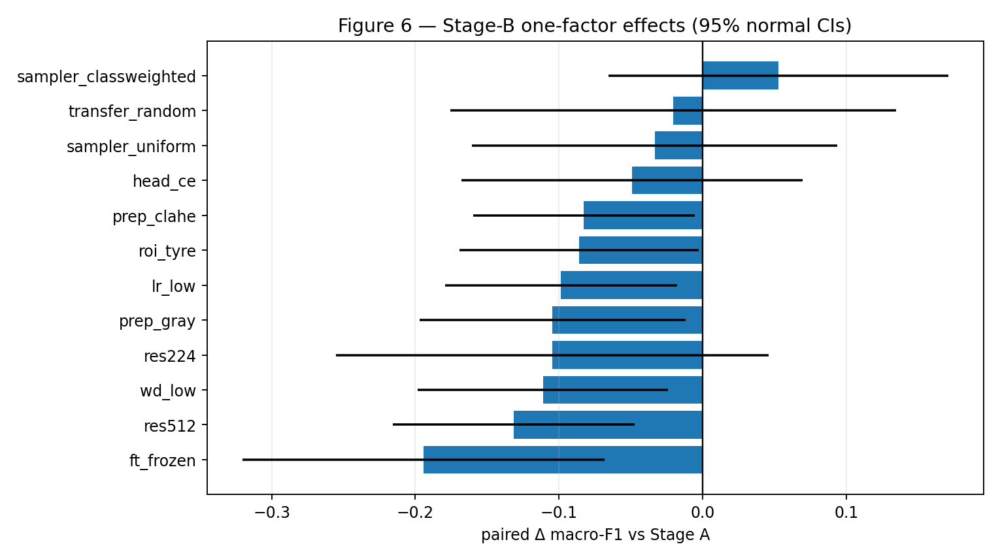

*Figure 6. Preserved discovery OFAT panel. This is Stage B, not S4b confirmation. The source labels its whiskers “95% normal CIs”; these inherited run-based normal-approximation intervals are not independent-tyre population confidence intervals and are not used here to assert significance. Shared data, architectures and selection constrain interpretation.*

### 6.5 Dense-task completion and localisation

All 81 dense-task runs have completed 60 epochs and evaluation, yielding 4,860 epoch records. The previous S5 audit checked statuses, checkpoint/artifact hashes, native prediction coverage and recomputed downstream F1. This report reuses the pinned small reporting tables rather than downloading those checkpoints again.

**Table 4. Fold-1 localisation means across three seeds.** AP is on the 0–1 scale. Dashes denote unavailable quantities for box-only models. Restricting this table to fold 1 avoids presenting flagged-fold averages as the main localisation estimate, but fold 1 is still not an external test. [Source table](evidence/tables/s5_localisation_by_run.csv).

| Model | Box AP50:95 | Mask AP50:95 | Tread IoU | Tread boundary F1 |
| --- | --- | --- | --- | --- |
| deeplabv3plus_r34 | 0.98612 | 0.99675 | 0.97176 | 0.35988 |
| rtdetrv2_r18 | 0.94073 | — | — | — |
| segformer_b0 | 0.91189 | 0.99836 | 0.97372 | 0.37258 |
| segformer_b2 | 0.97657 | 0.99982 | 0.97569 | 0.37412 |
| unet_r34 | 0.91413 | 0.99704 | 0.97216 | 0.35820 |
| yolo26n_det | 0.95278 | — | — | — |
| yolo26n_seg | 0.95204 | 0.95890 | 0.85815 | 0.18926 |
| yolo26s_det | 0.96081 | — | — | — |
| yolo26s_seg | 0.95227 | 0.96215 | 0.85627 | 0.22623 |

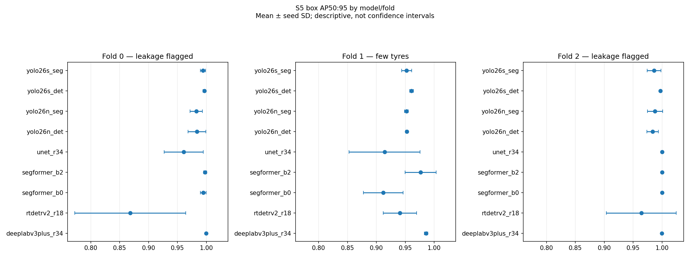

*Figure 7. Box AP50:95 by model and fold. Bars summarise the existing folds; error bars are standard deviations across three seeds, not confidence intervals across independent tyres.*

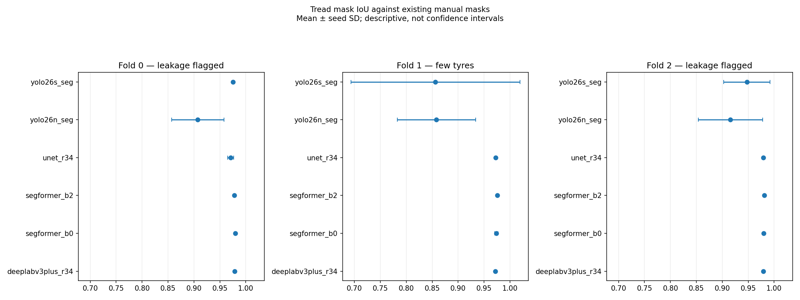

*Figure 8. Predicted tread-mask IoU against existing manual masks. Detector-only configurations do not supply mask IoU. This is model/reference agreement, not independent repeat annotation or a SAM2 comparison.*

Overlap and boundary metrics answer different questions. A predicted region may capture most tread area while missing narrow boundary details. Moreover, agreement with a reference mask does not by itself establish that the extracted region contains the causal signal for the proxy label. These distinctions motivate the downstream crop analysis rather than assuming that localisation quality guarantees classification benefit.

### 6.6 Predicted crops and fusion do not improve the overall mean

The mean predicted-tyre crop delta is −0.01257 macro-F1 and the predicted-tread delta is −0.01467, equally weighted across the 81 source runs. These averages do not imply every architecture/fold is negative. Shared classifier predictions and repeated use of the same images also mean the runs are dependent. The per-model/fold source summaries should accompany any narrower interpretation.

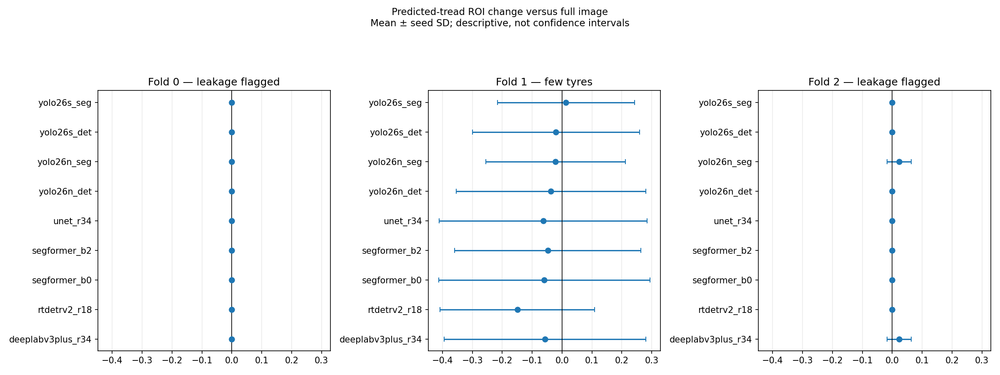

*Figure 9. Predicted-tread crop macro-F1 change relative to the matched frozen full-frame classifier. Zero means no change. Seed standard deviations describe run variation, not tyre-level uncertainty. The classifier was not retrained on crops.*

**Table 5. Fixed fusion analysis, descriptive mean paired deltas.** All five arms have 81 source-run rows; the full-frame arm is the paired reference. [Source table](evidence/tables/s9_fusion_by_run.csv).

| Fixed arm | Rows | Mean Δ macro-F1 |
| --- | --- | --- |
| full | 81 | 0.000000 |
| tyre_only | 81 | -0.012572 |
| tread_only | 81 | -0.014666 |
| tyre_tread_equal | 81 | -0.015676 |
| full_tyre_tread_equal | 81 | -0.013238 |

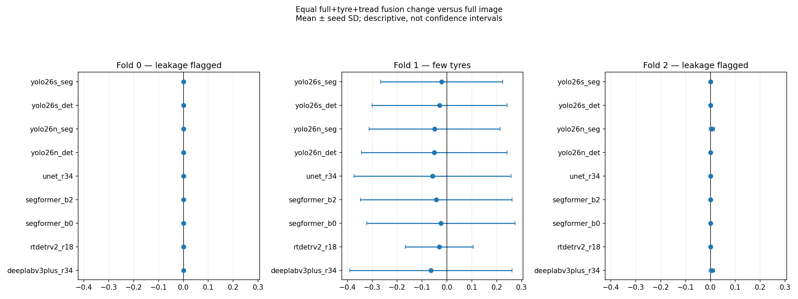

*Figure 10. Equal-probability full-frame/tyre/tread fusion relative to full frame. The rule was fixed; no learned fusion, weight optimisation or post-hoc winning-arm selection is claimed.*

The negative mean is scientifically useful: it rejects the assumption that adding localised views automatically improves this frozen classifier. Possible explanations include lost context, crop-induced scale changes, localisation errors and correlated information between views. The present experiment does not isolate their relative contributions. A crop-trained classifier or learned fusion model would be a new experiment requiring its own design and evaluation, not a wording change to this result.

### 6.7 Stress tests and uncertainty

NB08 contributes 63 stress-test rows. The shuffled-label fixed-final control mean of approximately 0.37518 is below the declared 0.45 audit threshold. Passing that specific control does not demonstrate absence of all leakage; the known session/tyre concerns remain. Perturbation responses are diagnostic and can involve distribution shift beyond the intended intervention.

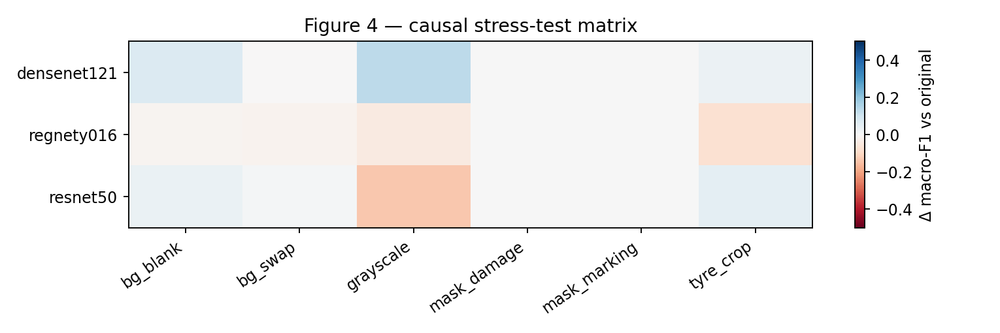

*Figure 11. Preserved stress-test panel. The source title says “causal”, but these are controlled image perturbations, not identified causal effects of physical wear. The fold-1 marking intervention is a no-op because that validation fold has no marking-positive reference images; a near-zero cell therefore cannot establish marking independence.*

**Table 6. Calibration on the retained held-out calibration-test subsets.** The `n` column is the test subset count, not the full validation-fold size. Temperature scaling changes confidence; macro-F1 is unchanged in these recorded rows. [Source table](evidence/tables/calibration.csv).

| Fold | Confidence | Test n | Macro-F1 | ECE | NLL | Brier |
| --- | --- | --- | --- | --- | --- | --- |
| 0 | raw | 61 | 1.00000 | 0.21146 | 0.24251 | 0.07654 |
| 0 | temperature | 61 | 1.00000 | 0.00000 | 0.00000 | 0.00000 |
| 1 | raw | 41 | 0.80303 | 0.18955 | 0.35630 | 0.17877 |
| 1 | temperature | 41 | 0.80303 | 0.07377 | 0.16226 | 0.10683 |
| 2 | raw | 33 | 1.00000 | 0.12929 | 0.14378 | 0.04018 |
| 2 | temperature | 33 | 1.00000 | 0.00000 | 0.00000 | 0.00000 |

**Table 7. Conformal diagnostics at nominal 90% coverage.** [Source table](evidence/tables/conformal.csv).

| Fold | Calibration n | Test n | Coverage | Mean set size | Recorded abstention |
| --- | --- | --- | --- | --- | --- |
| 0 | 62 | 61 | 0.86885 | 0.86885 | 0.00000 |
| 1 | 43 | 41 | 0.97561 | 1.09756 | 0.09756 |
| 2 | 35 | 33 | 0.93939 | 0.93939 | 0.00000 |

Fold 0 achieves 0.86885 coverage, below nominal; folds 1 and 2 achieve 0.97561 and 0.93939, respectively. It would be incorrect to say that every fold misses nominal coverage, or that all future data are guaranteed covered. The small test subsets and dependent acquisition structure constrain the interpretation. Mean set sizes below one indicate empty sets occur; the inherited abstention field does not by itself count all empty-set failures. It must not be presented as a complete uncertainty-based rejection policy. Extremely small calibrated errors on flagged folds are not evidence of deployment-grade certainty.

### 6.8 Matched boundary localisation: benefit within the study

**Table 8. Same-split, fixed-final geometry results.** Values are percentages of native image width; lower is better. Each seed evaluates the same 24 images from two tyres. [Audited inputs](evidence/geometry/comparison_REPORT.json).

| Seed | HRNet error (% width) | SegFormer error (% width) | SegFormer coverage |
| --- | --- | --- | --- |
| 1 | 1.391 | 1.788 | 100% |
| 2 | 1.284 | 1.705 | 100% |
| 3 | 1.261 | 1.668 | 100% |
| Mean | 1.312 | 1.721 | 100% |

HRNet's three-seed mean is **1.312% / 15.10 px**, compared with **1.721% / 19.80 px** for SegFormer. This is a 0.409 percentage-point or 4.70-pixel absolute reduction, and a **23.75% relative reduction in mean point error**, not a classification-accuracy improvement. HRNet has lower mean error in all three seeds and on both test tyres. All SegFormer boundaries are present, so raw and fallback-assisted scores coincide. No test-selected winner seed or evaluated ensemble is claimed.

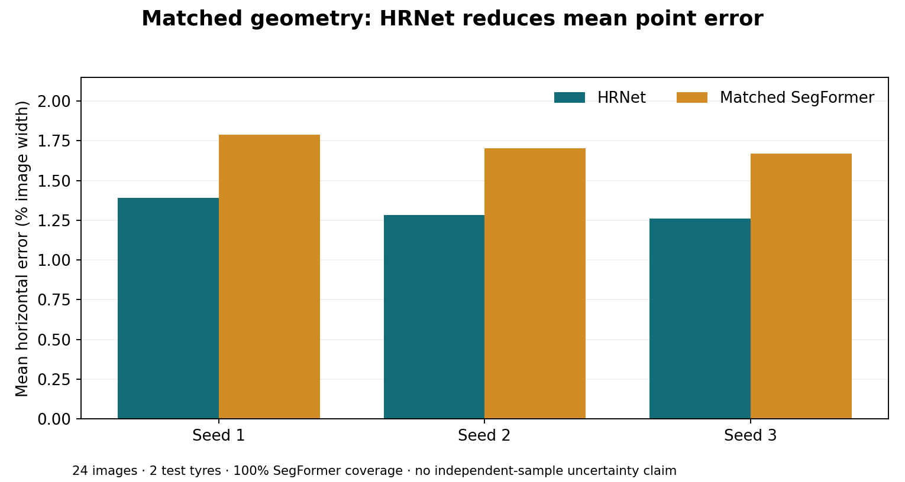

*Figure 12. Recomputed geometry comparison from frozen HF records. Equal training budget and identical test points do not imply equal supervision. No significance interval is inferred from three seeds.*

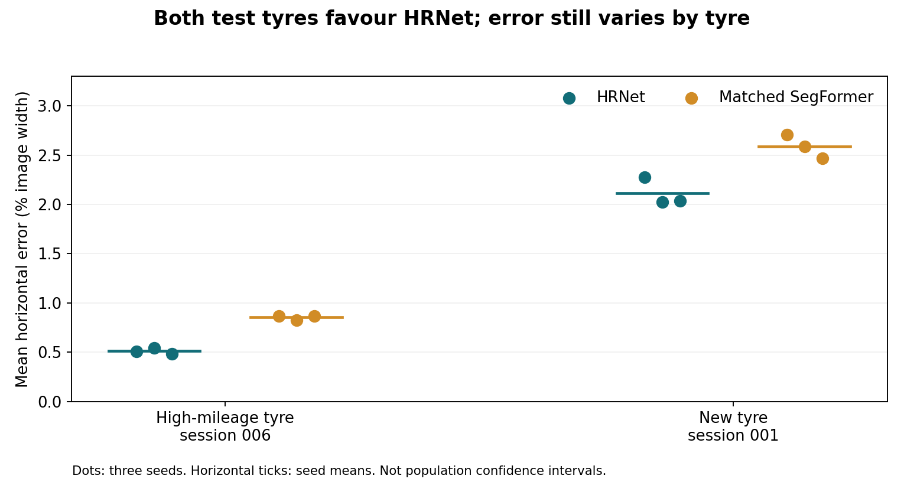

*Figure 13. Both test tyres have lower mean HRNet error in each seed, but the new-tyre example has larger error for both models. Dots are individual seeds and horizontal marks their means, not population confidence intervals.*

### 6.9 Native app and learned-geometry integration

The optional app is no longer an unbuilt proposal. Tread Station is a native PySide6/PyTorch desktop workstation with image/video loading, asynchronous inference, model comparison, portrait-aware playback, overlays, saved evidence and restoration. Four existing classifier/region models remain available; HRNet and matched SegFormer are optional geometry components, not silent replacements for the S5 region model. Learned overlays expose widths, midpoint lines, raw coordinates, model hashes and disagreement flags. Evidence records preserve the actual analysed frame rather than painting an old result on a new preview.

Saved local checks verify strict checkpoint loading, original preprocessing/coordinate decoding, repeatability, blank-input flags, temporal resets and lossless evidence restoration. UI tests exercise all three supplied videos, overlay toggles, seek reset, diagrams, PNG/JSON export and model release. These are existing test artifacts inspected for this report, not new test runs performed during writing. A local GPU operational check on one internal still recorded the following five warm measurements:

| Component | Five-run median (ms) | Observed range (ms) |
| --- | --- | --- |
| HRNet-W18 | 72.60 | 51.41–88.46 |
| Matched SegFormer-B0 | 33.48 | 33.32–33.84 |

Both timings include preprocessing, forward pass, extraction and GPU synchronisation, but exclude weight loading and file decoding. Hardware is a GTX 1650, not the training T4. Peak allocated memory in the two-model check was 182.0 MiB; full-pipeline video snapshots reported roughly 271–279 MiB. These small samples are not guaranteed camera FPS, sustained throughput or an independently controlled efficiency benchmark. HRNet's point-error advantage therefore carries additional observed inference cost; accuracy and speed must not be conflated.

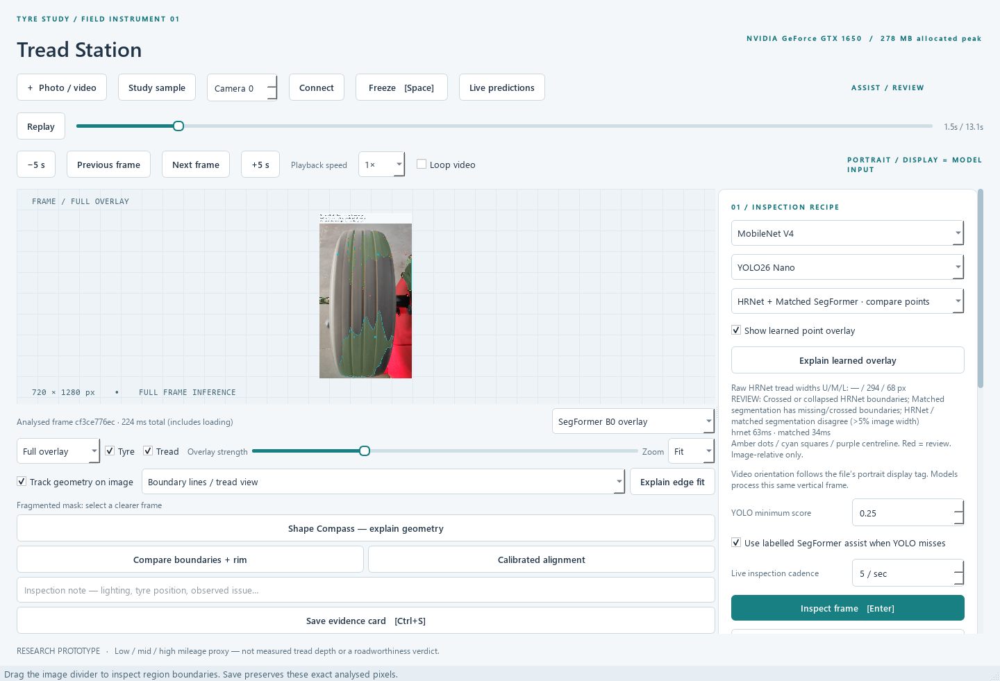

*Figure 14. Existing desktop prototype on a supplied video. The app is implemented; its visible flags and overlays do not establish field accuracy or physical webcam performance.*

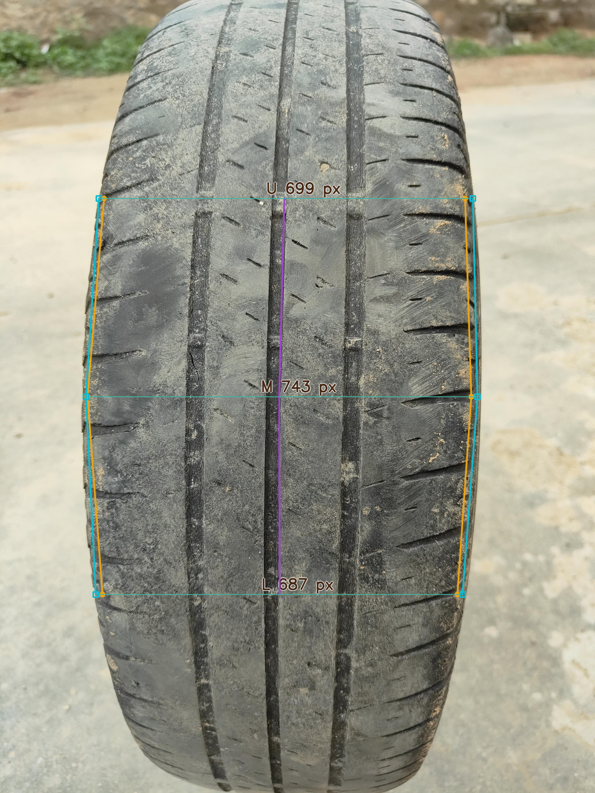

*Figure 15. Existing qualitative still-image integration check. Amber points/lines are HRNet, cyan squares are matched SegFormer, and the purple line is an image-space midpoint line. Widths are pixels, not millimetres or alignment angles. This is a selected operational example, not a new held-out aggregate result.*

### 6.10 Deployment-domain failures are part of the result

The local video tests passed their software assertions but also exposed model limitations. The reviewed video1 and Video2 frames contain crossed or collapsed HRNet boundaries; all three clips trigger HRNet/matched disagreement, and some matched boundaries are missing. Crossed pairs withhold widths/connecting geometry; raw proposals remain visible for review. Display smoothing is not proof of correctness: a stable wrong prediction can remain stable. The clips have no point ground truth, so no video localisation accuracy or temporal robustness score is claimed. Their framing, appearance and motion differ from the small training collection.

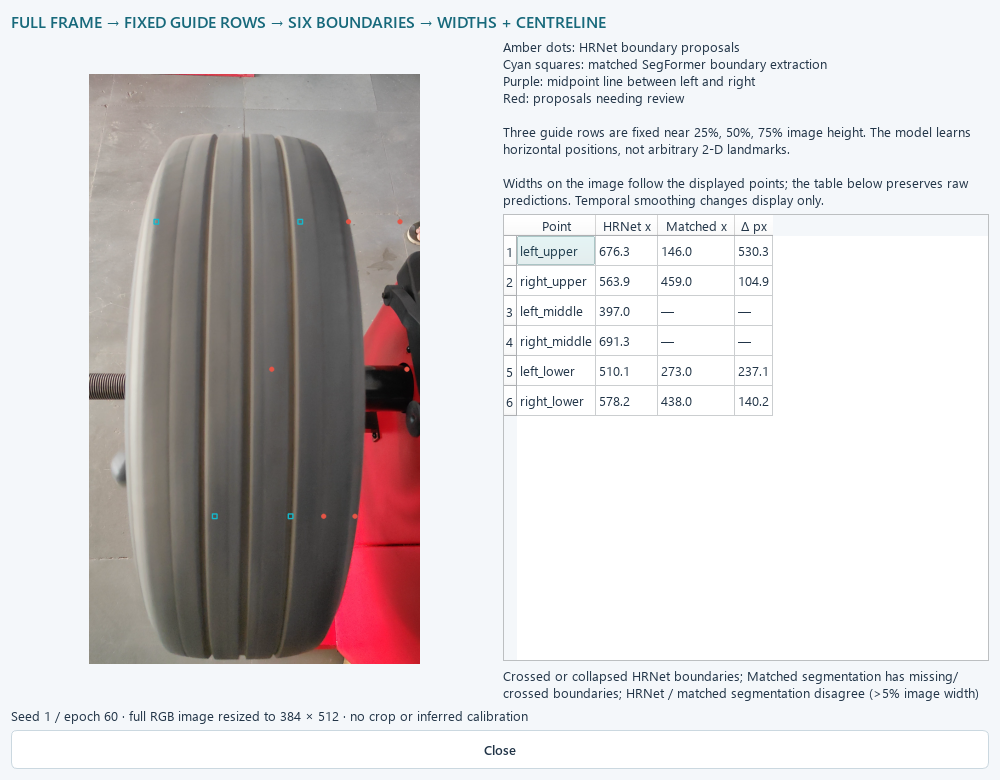

*Figure 16. Preserved failure example from video1. Red proposals, missing entries and crossed-boundary flags are intentionally shown. A passing UI test and a lower still-image benchmark error do not imply deployment-ready predictions.*

### 6.11 Alignment software exists; physical validation remains separate

The implemented target-assisted path generates two distinct ChArUco boards, creates/loads camera profiles, solves ground and wheel target poses in the same frame and computes single-wheel camber/toe in an explicitly defined vehicle coordinate frame. The interface accepts independent reference readings and exports images, camera profiles, pose residuals and measurements. It withholds results when a required target or setup confirmation is missing. Learned tread points and mask/rim hypotheses are supporting image evidence, not the physical reference frame.

The saved alignment check uses rendered target/calibration images, known synthetic poses and UI controls. It exercises signed angles on both sides, missing targets, scaling/orientation, setup gating and evidence export. These tests validate software behaviour; the supplied videos do not contain the calibrated dual-target setup. Real camera calibration, level/heading reference, verified wheel-plane mounting, repeat-remount trials and comparison with an independent instrument are still required to quantify physical error. No fixture/runout compensation, universal vehicle tolerance, roadworthiness verdict or target-free 3-D alignment claim is supported.

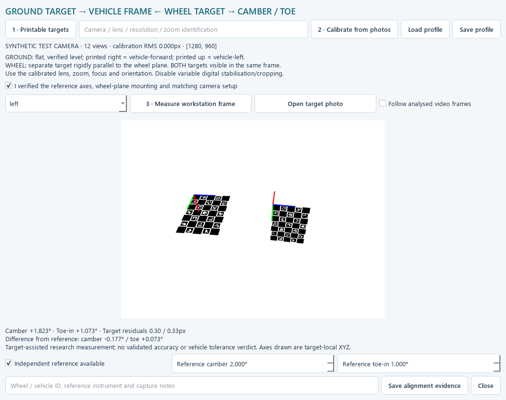

*Figure 17. Existing software-test screenshot, explicitly labelled SYNTHETIC TEST CAMERA. Displayed angles and residuals are synthetic test outputs, not a real-wheel calibration result or claimed measurement accuracy.*

## 7. Discussion

### 7.1 What the project establishes

The strongest evidence is that a broad, auditable workflow has been executed on this collection, with explicit endpoint preservation, model-identity checks, manual-supervised dense tasks and fixed paired analyses. It demonstrates the feasibility of collecting comparable prediction artifacts across heterogeneous backends while preserving the failures and negative results needed for interpretation. It also shows why a final report should not merely repeat the largest accuracy number.

The sweep is descriptive rather than a universal architecture ranking. The explanation shortlist is a reproducible selection procedure, not proof that selected models generalise better. S4b reveals endpoint-dependent sampling effects and consistently harmful random initialisation for the two tested confirmation models. Dense localisation and downstream classification should be evaluated separately: a good region estimate does not ensure a gain when inserted into a classifier trained on full frames.

### 7.2 What cannot be concluded

No result here establishes a relationship between class probability and millimetres of remaining tread, a safety threshold, an alignment angle, or a failure diagnosis. No external tyre-level benchmark is available. No claim of causal explanation follows from a high TER or a visually appealing CAM. No claim of SAM2 superiority or annotator consistency follows from manual-mask supervision. No full HRNet/PatchCore pipeline was implemented by the fixed-fusion notebook.

It is also inappropriate to manufacture one overall completion percentage. Completing 81/81 dense runs is precise within that frozen scope. It does not supply the missing data for unexecuted original experiments. The stage ledger is a more faithful account of progress than turning every stage green.

### 7.3 Threats to validity

**Construct validity:** Mileage is a proxy for the desired property, and manually drawn regions are not physical wear measurements. Alignment requires additional geometric references. **Internal validity:** Known overlap flags, repeated validation use, selected-checkpoint reporting and architecture-specific runtime differences can affect comparisons. **External validity:** One brief acquisition session, few identity groups and limited environments constrain transfer. **Conclusion validity:** Multiple architectures and interventions share the same data; seed variation is not independent sampling uncertainty and post-hoc favourable comparisons would inflate confidence.

**Measurement validity:** IoU is insensitive to some boundary details; CAM resolution and target-layer choices influence spatial metrics; empty conformal sets need explicit treatment. **Operational validity:** Temporary sessions and upload windows limit recoverability. Public status and matching hashes establish artifact consistency, not automatic scientific correctness. **Reporting validity:** Historical proposal documents mix planned and completed components, which is why this report carries explicit scope and source mappings.

### 7.4 Ethical, safety and licensing considerations

This pilot should not be used to decide whether a vehicle is safe to drive or a tyre should remain in service. Any deployment claim requires appropriate physical inspection and independent validation. Before wider redistribution, authors should review image ownership, incidental identifying content, dataset terms and model licences. A public Hugging Face repository is not by itself proof of permission to redistribute every asset. The project code's MIT licence does not override external dataset, pretrained-weight or backend obligations.

## 8. Reproducibility and artifact provenance

The earlier S10 reporting snapshot is [Shanmuk4622/tyre-wear-study at 22d5a6bc](https://huggingface.co/datasets/Shanmuk4622/tyre-wear-study/tree/22d5a6bc9f953ba3bf2a75919edc7db3193b317b), namespace `s10/reporting-r1/2a333e2a6469905ad8cb822821ea46a357364e6d17bdd53c153c8b7e51fd217e/`. Geometry is separately pinned to HRNet report `a92c0f9c5c1b78c6a06e13d51e18722195230658` and matched report `bbe586c6f00cf12ae4cac8b2e9cb4f875b272abb`. Local prototype evidence has filesystem hashes, not an invented HF publication.

NB19 collected 38 source files: 25 tables, ten inherited figures and three upstream status records. NB20 added four figures and the reporting artifacts, producing 14 inherited/public figures in total. The [evidence manifest](evidence/evidence_manifest.json) maps each local source to its original HF path, revision, byte count and SHA256. The [report status](evidence/REPORT_STATUS.json) lists report artifact hashes. Different collection and publication revisions are expected; they do not mean the data were silently changed.

This refreshed edition retains the original 14 public figures, updates its study-flow diagram and keeps the endpoint chart. Two geometry charts and four saved prototype screenshots bring the total to 22 visuals. The original 38-file evidence cache remains byte-for-byte unchanged. A separate [geometry/local evidence manifest](evidence/geometry_manifest.json) records the added JSON and screenshot sources and hashes. Rebuilding uses only local inputs and performs no training or publication.

Artifact verification is layered. This documentation build verifies cached evidence and report hashes, row-count invariants, local links, images, unresolved markers and output integrity. Earlier audit records document full training checkpoint and prediction verification. This documentation pass does not re-download or re-audit every large checkpoint, and it does not claim an independent re-execution of training.

## 9. Conclusions and next work

The completed tracks support a pilot study of mileage-proxy recognition, tyre/tread localisation and learned image-space geometry. They expose endpoint/fold sensitivity and no average gain from frozen-classifier crop/fusion interventions. HRNet reduces point error in the matched two-tyre test, while integrated video examples reveal domain limitations. The native app and target-assisted measurement software are implemented; physical accuracy, external generalisation and the original full Tier8/PatchCore experiment remain unestablished.

The documentation refresh is complete: Markdown and rendered report now include the matched results and implemented prototype. Next are author/template review and deployment-domain research validation, not another annotation pilot or duplicate integration build. Review the crossed-boundary failures on supplied clips, define a held-out video evaluation and evaluate full-system/component effects under a frozen scope. Physical alignment needs real target/camera/fixture measurements and independent references. PatchCore needs an independently justified healthy-reference pool; mileage labels alone cannot supply it.

A stronger future study should prioritise independently identified tyres, wider acquisition conditions and target-matched measurements before multiplying model runs. A new tyre-held-out split should be frozen before evaluating additional crop-trained models, learned fusion or calibration policies. Negative current results should remain part of the record even if future experiments improve them.

## Appendix A. Supplementary figure archive

These figures are preserved from NB10R rather than redrawn as if they represented new experiments. Their original file identifiers differ from this report's sequential main-text numbering. The saliency image is unusually tall and its source title overlaps the top labels; open the original at full resolution for inspection. This known source-layout issue is not concealed by editing the scientific pixels.

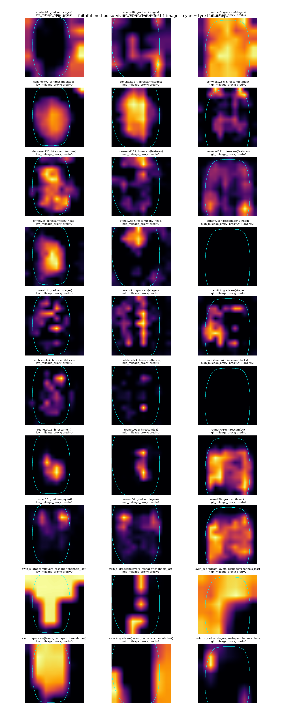

*Figure A1. Thirty saliency panels: ten surviving architecture/method rows and three sampled fold-1 images. Cyan marks the tyre boundary; these are saliency maps, not new raw-image overlays. Zero maps remain explicitly visible. Qualitative samples do not represent a quantitative independent test.*

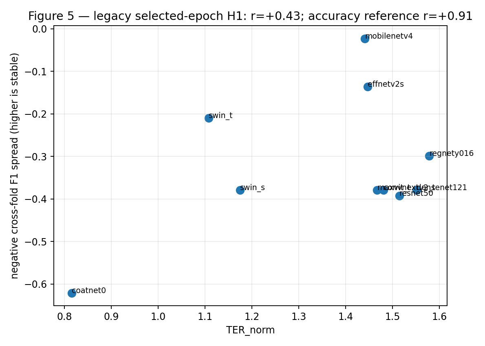

*Figure A2. Legacy selected-endpoint H1 stability diagnostic. It does not establish the proposed superiority of TER-based stability prediction or replace a fixed-final analysis. Several source point labels overlap; the numeric H1 result is retained in the linked hypothesis table rather than inferred from those labels.*

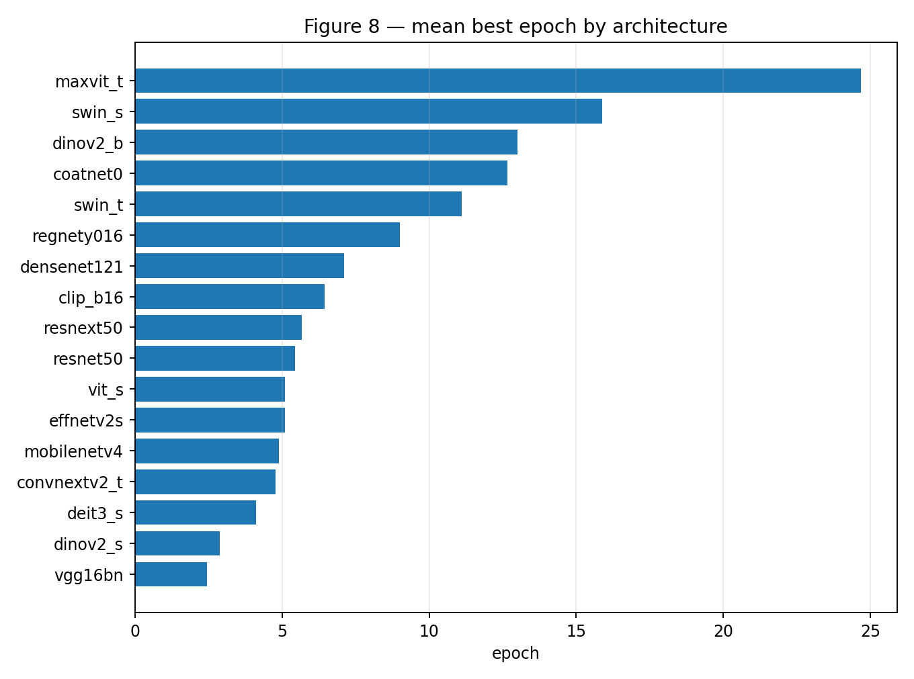

*Figure A3. Best-epoch diagnostic. This is not the original proposed video temporal-consistency experiment.*

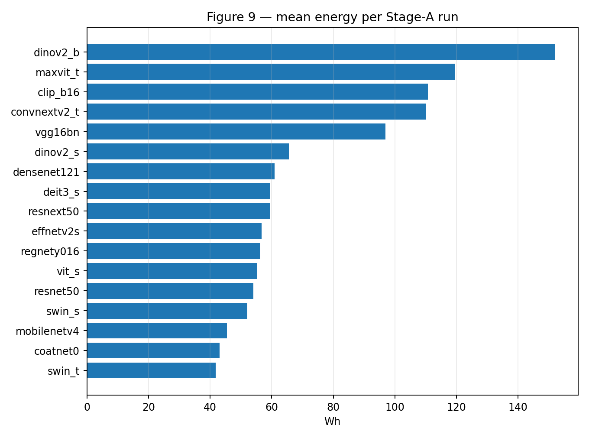

*Figure A4. Recorded energy comparison under the observed execution conditions. Do not treat this as a controlled hardware-efficiency benchmark or a full lifecycle carbon estimate.*

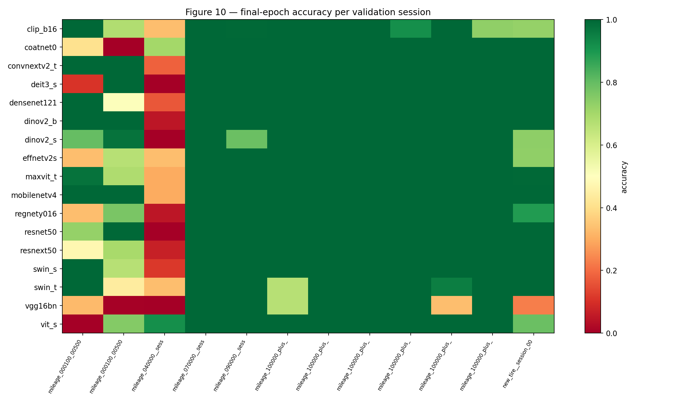

*Figure A5. Final-epoch per-session accuracy under the existing grouping, not macro-F1. Sessions are not independently verified tyre identities. Some long source session labels are abbreviated; original IDs remain in source records. This figure does not supply the missing crossed factorial or video experiments.*

## Appendix B. Submission and documentation map

- [Reproducibility appendix](REPRODUCIBILITY.md): notebook order, environment, evidence map, resume semantics and reproduction commands.
- [Claims, limitations and figure audit](CLAIMS_AND_LIMITATIONS.md): permitted wording, unsupported claims, source-layout caveats and open research gaps.
- [References and verification notes](REFERENCES.md): primary literature and software references, with scope of use.
- [Submission checklist](SUBMISSION_CHECKLIST.md): author review, rights, required template, declarations and final checks.
- [Repository guide](../REPOSITORY_GUIDE.md): active documentation, historical design records, notebooks, code and generated artifacts.

No author contribution roles, funding declaration, ethics approval, permissions or supervisor sign-off have been invented. They must be completed by the authors where required.

## References

1. Huber, S., Preindl, P., and Betz, J. (2022). **TireEye: Optical On-board Tire Wear Detection.** *Annual Conference of the PHM Society*, 14(1). DOI: 10.36001/phmconf.2022.v14i1.3242. [Primary publication](https://papers.phmsociety.org/index.php/phmconf/article/view/3242).

2. He, K., Zhang, X., Ren, S., and Sun, J. (2016). **Deep Residual Learning for Image Recognition.** *CVPR*, 770–778. [Primary publication](https://openaccess.thecvf.com/content_cvpr_2016/html/He_Deep_Residual_Learning_CVPR_2016_paper.html).

3. Cao, W., Mirjalili, V., and Raschka, S. (2019). **Rank consistent ordinal regression for neural networks with application to age estimation.** arXiv:1901.07884, preprint record. [Primary preprint](https://arxiv.org/abs/1901.07884).

4. Selvaraju, R. R., Cogswell, M., Das, A., Vedantam, R., Parikh, D., and Batra, D. (2017). **Grad-CAM: Visual Explanations from Deep Networks via Gradient-Based Localization.** *ICCV*; preprint arXiv:1610.02391. [Primary preprint record](https://arxiv.org/abs/1610.02391).

5. Adebayo, J., Gilmer, J., Muelly, M., Goodfellow, I., Hardt, M., and Kim, B. (2018). **Sanity Checks for Saliency Maps.** *NeurIPS*, 31. [Primary publication](https://proceedings.neurips.cc/paper/2018/hash/294a8ed24b1ad22ec2e7efea049b8737-Abstract.html).

6. Ronneberger, O., Fischer, P., and Brox, T. (2015). **U-Net: Convolutional Networks for Biomedical Image Segmentation.** arXiv:1505.04597, preprint record. [Primary preprint](https://arxiv.org/abs/1505.04597).

7. Chen, L.-C., Zhu, Y., Papandreou, G., Schroff, F., and Adam, H. (2018). **Encoder-Decoder with Atrous Separable Convolution for Semantic Image Segmentation.** arXiv:1802.02611, preprint record. [Primary preprint](https://arxiv.org/abs/1802.02611).

8. Xie, E., Wang, W., Yu, Z., Anandkumar, A., Alvarez, J. M., and Luo, P. (2021). **SegFormer: Simple and Efficient Design for Semantic Segmentation with Transformers.** *NeurIPS*, 34. [Primary publication](https://proceedings.neurips.cc/paper_files/paper/2021/hash/64f1f27bf1b4ec22924fd0acb550c235-Abstract.html).

9. Ultralytics. **YOLO26 model documentation.** Software documentation, accessed 12 September 2026. [Official documentation](https://docs.ultralytics.com/models/yolo26/). Executed study library pin: Ultralytics 8.4.20; the current web page is not an immutable specification of that version.

10. Peking University / Hugging Face. **RT-DETRv2-R18 model card and Transformers integration.** Model/software documentation, accessed 12 September 2026. [Exact model card](https://huggingface.co/PekingU/rtdetr_v2_r18vd), [official integration documentation](https://huggingface.co/docs/transformers/model_doc/rt_detr_v2). The study uses its frozen protocol revision rather than mutable model-card examples.

11. Guo, C., Pleiss, G., Sun, Y., and Weinberger, K. Q. (2017). **On Calibration of Modern Neural Networks.** *ICML*, PMLR 70, 1321–1330. [Primary publication](https://proceedings.mlr.press/v70/guo17a.html).

12. Angelopoulos, A. N., and Bates, S. (2021). **A Gentle Introduction to Conformal Prediction and Distribution-Free Uncertainty Quantification.** arXiv:2107.07511, preprint record. [Primary preprint](https://arxiv.org/abs/2107.07511).
13. Sun, K., Xiao, B., Liu, D., and Wang, J. (2019). **Deep High-Resolution Representation Learning for Human Pose Estimation.** *CVPR*. [Primary publication](https://openaccess.thecvf.com/content_CVPR_2019/html/Sun_Deep_High-Resolution_Representation_Learning_for_Human_Pose_Estimation_CVPR_2019_paper.html). Architecture foundation, not a tyre-accuracy claim.

14. OpenCV. **Detection of ChArUco Boards.** Official software documentation, accessed 15 September 2026. [Board detection and pose documentation](https://docs.opencv.org/4.13.0/df/d4a/tutorial_charuco_detection.html). The prototype's tested runtime remains OpenCV 4.11; this reference is not a version upgrade or physical-accuracy certificate.
13. Sun, K., Xiao, B., Liu, D., and Wang, J. (2019). **Deep High-Resolution Representation Learning for Human Pose Estimation.** *CVPR*. [Primary publication](https://openaccess.thecvf.com/content_CVPR_2019/html/Sun_Deep_High-Resolution_Representation_Learning_for_Human_Pose_Estimation_CVPR_2019_paper.html). Architecture foundation, not a tyre-accuracy claim.

14. OpenCV. **Detection of ChArUco Boards.** Official software documentation, accessed 15 September 2026. [Board detection and pose documentation](https://docs.opencv.org/4.13.0/df/d4a/tutorial_charuco_detection.html). The prototype's tested runtime remains OpenCV 4.11; this reference is not a version upgrade or physical-accuracy certificate.
